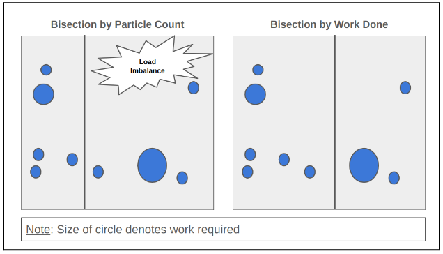
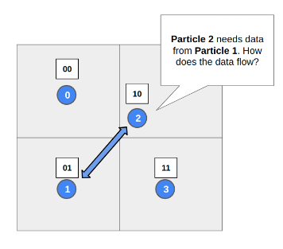
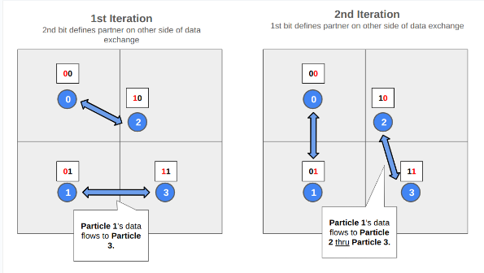
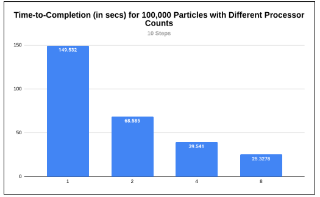

# 1. TLDR
I present findings from a parallel implementation of Barnes-Hut n-body simulation, where we achieve up to 6x speedup from 1 process to 8 process.

# 2. Design behind Parallel Implementation
## 2.1 Central Problem of Parallelisng Barnes-Hut
There are two stages to Barnes-Hut: (a) constructing a tree, and (b) computing forces on each particle from the tree. Parallelising force computation in stage (b) is trivial. However, it is not clear how we can parallelise the construction of the tree in stage (a).

Assuming stages (a) and (b) take roughly equal time (given that their theoretical time complexity is O(n log n) each), Amdahl’s law indicates that going from 1 processor to 8 processor can only result in 1.78x speedup (with only 50% of the entire programme parallelised).

However, this lab has achieved at 6x speedup when going from 1 process to 8 processors. We achieved this using a parallel setup defined in Salmon (1991), which this report will explore in some depth.

The key idea from Salmon (1991) is to construct locally sufficient subtrees within each processor. Each processor will be responsible for particles within a spatial segment, and will construct their respective subtrees. However, each subtree will not yet be sufficient for force computation. The subtree is only locally sufficient after a round of data exchange between processors, facilitated by MPI as the message passing model. 

## 2.2 Domain Decomposition
For each iteration of a Barnes-Hut time-step, we ask ourselves: how can we decompose the domain across different processors, such that each processor is assigned fairly equal work? If we fail to do so, load imbalances will reduce gains from parallelism; some processors will be idle while other processors are performing effortful force computations.

The naive approach is to decompose the space into equal segments of n_processors, and allocate each processor to a segment. This would have resulted in a uniform grid for 2D, or a cube for 3D.

However, this naive approach encounters two problems. First, certain spatial segments may have greater concentration of particles. Second, even if each processor handles the same number of particles, the force computation workload might not be evenly spread. This unevenness happens because each update to a particle requires different traversal depths of the Barnes-Hut tree.

The solution proposed in Salmon (1991), is to use orthogonal recursive bisection that is sensitive to the workload that had just been executed by the particle in the previous iteration. This is intuitively sound. Assuming a small enough dt, the update to each particle should be incremental, and so the work required in the current iteration should not deviate materially from the work in the previous iteration. Figure 1 illustrates this idea.

<b>Figure 1: Comparison of Naive Bisection v.s. Work-sensitive Bisection</b>

    

Each processor establishes log n number of partners, on the other side of a bisection. We index each partner using bitwise operations. The usefulness of each processor having a partner across each bisection will be apparent in sub-section 2.3. For now, we already have an algorithm for orthogonal recursive bisection, which enables even load balancing across processors.

Before we proceed to the next section, we should be aware that there are two blocking operations across processors.
- First, each processor handles a segment of bisection, for every iteration of a time step. However, each processor is unable to have a global view of the work required within each spatial segment. So our program requires message passing whenever it considers the suitability of a bisection split.
- Second, after every bisection, the processors assigned to each bisection may not have all the particles they are responsible for. This requires an exchange of bodies with partner processors, which are at the other side of the bisection.

The waiting at each message passing segment of the code results in idle time, and will dampen parallel gains--though not by much as subsequent results will show.

## 2.3 Locally Sufficient Subtrees
After allocating particles to each processor, the next job is force computation. A key insight by Salmon (1991) is that we can create **locally sufficient subtrees**. This however requires a slight modification to the multipole acceptance criterion.

The following paragraphs expand on the above points.

### 2.3.1 Message Passing to generate Locally Sufficient Subtrees
To construct locally sufficient subtrees, the processors first build local subtrees (which are insufficient for force computation). The subtrees are only sufficient after exchanging data with their partners from domain decomposition (ref. sub-section 2.2).

This data exchange is designed such that a processor only needs to communicate to log n other processors, not n-1 number of processors.

Figure 2 shows how data flows between particles, where there is a barrier between the 1st and 2nd iterations to ensure correctness.

<b>Figure 2: Data Flow between Particles</b>

    

    

### 2.3.2 Modification to Multipole Acceptance Criterion

Prior to every data exchange, a processor has to figure out what data its partner on the other side of the bisection might need. At this juncture, the processor simply knows the domain of its partner (i.e. the bounding box).

However, the processor lacks all necessary information to compute the centre-of-mass at each node of its local tree and determine the granularity of information required by its partner (i.e. whether a node at a greater depth should be passed to its partner). The processor lacks all necessary information, because its local tree may have more branches and particles after subsequent data exchanges.

Salmon (1991) modifies the Barnes-Hut multipole acceptance criterion, which is adopted in this lab. Salmon (1991)’s criterion takes the ratio of the (a) distance between the domain and each node of the local tree, and (b) the area (for 2D) or volume (for 3D) spanned by the node. A function takes this ratio, as well as a parameter theta, and outputs a boolean indicating whether (a) the current node is sufficient or (b) the processor seeking to meet its partner’s force computation needs should traverse deeper to retrieve a child node with tighter spatial bounds.

Salmon (1991) further demonstrates that this modification to the multipole acceptance criterion is a fair estimate for the resulting force computations, and this modification shares the same geometrical intuitions as Barnes-Hut's original criterion.

# 3. Results
## 3.1 Experimental Setup
I now present results from our experimental setup, where every experiment is parameterised by:
- dt = 0.005;
- theta = 0.5;
- s = 10;
- rlimit = 0.03; and
- G = 0.0001.

My sequential implementation is executed simply by setting the number of processors to 1. Doing so skips activities like orthogonal recursion bisection (in sub-section 2.2) and data exchange for locally sufficient trees (in sub-section 2.3), and performs basic tree construction and force computation for every particle.

## 3.2 Particle Count of 100,000
We witness a 6x speedup when going from 1 process to 8 processors. This is a realistic result, given the extensive refactoring of Barnes-Hut by Salmon (1991), using techniques like workload-sensitive domain decomposition, as well as locally sufficient subtrees.

<b>Figure 3: Results from 100,000 Particle Count</b>

    

# 4. Concluding Remarks
There are further optimisations that we can explore:
- Salmon (1991) points out that the use of Gray Codes during domain decomposition for bitwise assignment of processors can ensure more continuity in particle assignment across each iteration. This reduces the number of particles that need to be exchanged during the orthogonal recursive bisection section of domain decomposition.
- Salmon & Warren (1993) explores domain decomposition that is more closely related to the Barnes-Hut tree topology, by mapping spatial coordinates to keys. This adjustment to Salmon (1991)’s original approach is expected to reduce the number of nodes that needs to be exchanged to achieve locally sufficient subtrees.

# References
- Barkman, P. (2017) et al. N-body. GitHub. https://github.com/barkm/n-body
- Salmon, J. K. (1991). Parallel hierarchical N-body methods (Doctoral dissertation). California Institute of Technology.
- Salmon, J. K. & Warren, M (1993). A Parallel Hashed Oct-Tree N-Body Algorithm. California Institute of Technology & Los Almos National Laboratory.
